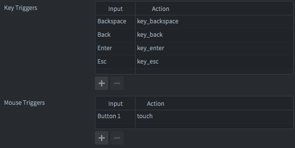

# Advanced Druid Setup


## Input Bindings

By default, **Druid** utilizes the `/builtins/input/all.input_binding` for input bindings.

**Druid** requires the following input bindings:

- Mouse trigger: `Button 1` -> `touch` (for basic input components)
- Mouse trigger: `Wheel up` -> `mouse_wheel_up` (for Scroll component)
- Mouse trigger: `Wheel down` -> `mouse_wheel_down` (for Scroll component)
- Key trigger: `Backspace` -> `key_backspace` (for BackHandler component, input component)
- Key trigger: `Back` -> `key_back` (for BackHandler component, Android back button, input component)
- Key trigger: `Enter` -> `key_enter` (for Input component, optional)
- Key trigger: `Esc` -> `key_esc` (for Input component, optional)
- Touch triggers: `Touch multi` -> `touch_multi` (for Scroll component)




## Changing Key Bindings

If you need to use your own key bindings or key names, you can modify them in your *game.project* file.

Here are the default values for key bindings:
```
[druid]
input_text = text
input_touch = touch
input_marked_text = marked_text
input_key_esc = key_esc
input_key_back = key_back
input_key_enter = key_enter
input_key_backspace = key_backspace
input_multitouch = touch_multi
input_scroll_up = mouse_wheel_up
input_scroll_down = mouse_wheel_down
```


## Input Capturing

By default, **Druid** automatically captures input focus if any input component is created. Therefore, you do not need to call `msg.post(".", "acquire_input_focus")`.

If you do not require this behavior, you can disable it by setting the `druid.no_auto_input` field in the _game.project_ file:
```
[druid]
no_auto_input = 1
```


## Template Name Check

By default, **Druid** automatically checks the parent component's template name to construct the full template name for the component. It's used in user custom components.

If, for some reason, you want to pass the full template name manually, you can disable this feature by setting the `druid.no_auto_template` field in the _game.project_ file:

```
[druid]
no_auto_template = 1
```


## Stencil Check

When creating input components inside stencil nodes, **Druid** automatically sets up `component:set_click_zone()` during the _late_init_ component step to restrict input clicks outside of the stencil zone. This is particularly useful for buttons inside scroll stencil nodes.

To disable this feature, add the following field to your _game.project_ file:
```
[druid]
no_stencil_check = 1
```


## Code Bindings

Adjust **Druid** settings as needed:
```lua
local druid = require("druid.druid")

-- Used for button component and custom components
-- The callback should play the sound by name: function(sound_id) ... end
druid.set_sound_function(function(sound_id)
    -- sound_system.play(sound_id)
end)

-- Used for lang_text component
-- The callback should return the localized string by locale ID: function(locale_id) ... end
druid.set_text_function(function(locale_id)
	-- return lang.get(locale_id)
end)

-- Used to change the default Druid style
druid.set_default_style(your_style)

-- Call this function when the language changes in the game,
-- to retranslate all lang_text components:
local function on_language_change()
    druid.on_language_change()
end

-- Call this function inside window.set_listener
-- to capture game focus lost/gained callbacks:
-- window.set_listener(function(self, event, data) druid.on_window_callback(event, data) end))
local function on_window_callback(self, event, data)
    druid.on_window_callback(event)
end
window.set_listener(on_window_callback)
```


## EmmyLua Annotations

[EmmyLua](https://emmylua.github.io/annotation.html) is a Lua annotation library. It is a useful tool for enabling Lua code autocompletion in editors such as [VSCode](https://github.com/EmmyLua/VSCode-EmmyLua) and [IntelliJ IDEA](https://github.com/EmmyLua/IntelliJ-EmmyLua).

Since dependencies cannot be processed by external editors, to use the EmmyLua annotations, you should copy the _druid/annotations.lua_ file to your project.

Remember that you can restart the EmmyLua server to refresh the changes if something goes wrong.

After the annotations are processed, you should specify the type of "Druid" in the "require" statement:

```lua
---@type druid
local druid = require("druid.druid")

-- Now the autocomplete is working
```


